# Base de données myCommu

## Le choix : Cloud Firestore

Firebase propose deux bases : **Realtime Database** (un seul grand arbre JSON) et **Cloud Firestore** (documents rangés en collections, requêtes par champ, règles par document). myCommu utilise **Firestore**, pour quatre raisons :

1. **Requêtes par champ** : « les enseignements de telle communauté », « les communautés publiques juives », « les dons de tel fidèle » se font directement, sans tout télécharger.
2. **Règles par document et par rôle** : un trésorier voit les dons, pas les questions ; un fidèle voit ses promesses, pas celles des autres. Les règles lisent le rôle dans `memberships` et tranchent document par document.
3. **Temps réel** : chaque écran est abonné à ses requêtes ; une réponse du rabbin ou un nouvel horaire apparaît sur tous les téléphones sans recharger.
4. **Hors ligne** : le SDK garde un cache local, les écritures partent quand le réseau revient.

Base `(default)`, région `eur3` (Europe), mode natif.

## Principe de structure

- **Collections à plat** (pas de sous-collections) : chaque document de contenu porte un champ `congregationId`. Un fidèle membre de trois communautés charge ses contenus avec une seule requête `where congregationId in [...]`.
- **Les rôles vivent dans `memberships`**, une adhésion par couple (communauté, utilisateur), identifiée par `congregationId_uid` : la règle de sécurité la retrouve en un seul `get()`.
- **Les référentiels par confession** (courants, groupes) sont partagés ; les valeurs par défaut restent dans le code (`src/seeds/affiliations.ts`), la base ne contient que les ajouts.
- **Pas de serveur** : l'application écrit directement, les règles garantissent la cohérence.

## Diagramme

```mermaid
erDiagram
    users ||--o{ memberships : "adhère via"
    congregations ||--o{ memberships : "compte"
    congregations ||--o{ staffInvites : "codes d'accès"
    staffInvites |o--o| memberships : "active (inviteCode)"
    congregations }o--o| currents : "courant"
    congregations }o--o| groups : "groupe"
    groups ||--|| congregations : "chef de groupe"
    congregations ||--o{ paymentLinks : "Stripe / Bit / LS"
    congregations ||--o{ courses : "enseignements"
    congregations ||--o{ questions : ""
    congregations ||--o{ agenda : ""
    congregations ||--o{ dayEntries : "horaires du jour"
    congregations ||--o{ holidays : "fêtes"
    congregations ||--o{ donationCategories : ""
    congregations ||--o{ pledges : "promesses"
    congregations ||--o{ donations : ""
    congregations ||--o{ memberDates : ""
    congregations ||--o| lives : "direct en cours"
    users ||--o{ questions : "askerUid"
    users ||--o{ donations : "uid"
    users ||--o{ pledges : "memberUid"
    users ||--o{ memberDates : "uid"
    donations }o--o| pledges : "règle"
    donations }o--o| paymentLinks : "payé via"

    users {
        string id PK "uid Firebase"
        string name
        string email
        string community "jewish | muslim | christian | buddhist"
        string intent "member | leader"
        string phone
        string city
        string[] readCourses
        map maasserInput
    }
    congregations {
        string id PK
        string religion
        string leaderUid FK
        string name
        string code "XX-0000, unique"
        bool isPrivate
        string address
        string city
        string country "ISO"
        map coords "lat, lng"
        map rav "name, title, photo"
        map logo
        int members
        string currentId FK
        string groupId FK
        string[] themes
        map[] services
    }
    memberships {
        string id PK "congregationId_uid"
        string uid FK
        string congregationId FK
        string role "member | leader | deputy | treasurer | organizer"
        string name
        date joinedAt
        string joinedVia
        string inviteCode FK
    }
    staffInvites {
        string id PK "code RB- TR- OR-0000"
        string congregationId FK
        string role
        string name
        string contact
        string status "invited | active"
        string claimedBy FK
    }
    currents {
        string id PK
        string religion
        string name
        bool custom
    }
    groups {
        string id PK
        string religion
        string name
        string currentId FK
        string headCongregationId FK
    }
    paymentLinks {
        string id PK
        string congregationId FK
        string provider "stripe | bit | lemonsqueezy"
        string account
        string accountId
        bool isDefault
        datetime connectedAt
    }
    courses {
        string id PK
        string congregationId FK
        string authorUid FK
        string title
        string category
        date date
        bool featured
        map media
        map[] sections
    }
    questions {
        string id PK
        string congregationId FK
        string askerUid FK
        string subject
        string category
        string status "pending | answered"
        bool anonymous
        bool isPublic
        map[] messages
    }
    agenda {
        string id PK
        string congregationId FK
        string title
        date date
        string time
        string place
        string category
    }
    dayEntries {
        string id PK
        string congregationId FK
        date date
        string name
        string time
    }
    holidays {
        string id PK
        string congregationId FK
        string name
        string kind
        date start
        date end
        map[] times
    }
    donationCategories {
        string id PK
        string congregationId FK
        string name
        string icon
        map[] items "name, amount"
    }
    pledges {
        string id PK
        string congregationId FK
        string memberUid FK
        string member
        string label
        number amount
        date dueDate
        string status "due | paid"
        string note
    }
    donations {
        string id PK
        string congregationId FK
        string uid FK
        string type "tsedaka | maasser | engagement"
        number amount
        string cause
        date date
        string pledgeId FK
        string paymentLinkId FK
    }
    memberDates {
        string id PK
        string congregationId FK
        string uid FK
        string member
        string type "anniversaire | azkara | autre"
        date date
        string hebrewDate
    }
    lives {
        string id PK "= congregationId"
        string title
        datetime startedAt
        bool active
        string hostUid FK
    }
```

## Qui lit, qui écrit (résumé des règles)

| Collection | Lecture | Écriture |
|---|---|---|
| `users` | soi-même | soi-même |
| `congregations` | tout connecté | création : responsable (`leaderUid`) ; modification : leader/deputy ; organisateur : `services` ; membre : compteur `members` |
| `memberships` | soi-même, équipe de la communauté | soi-même : rôle `member`, `leader` de sa propre création, ou rôle d'équipe avec un `inviteCode` valide |
| `staffInvites` | `get` par code pour tout connecté ; liste : leader | leader ; activation (`status`, `claimedBy`) par le porteur du code |
| `currents`, `groups` | tout connecté | création : connecté / leader du groupe |
| `paymentLinks` | membres | leader, deputy, trésorier |
| `courses` | membres | leader, deputy |
| `agenda`, `dayEntries`, `holidays` | membres | leader, deputy, organisateur |
| `donationCategories` | membres | leader, deputy, trésorier |
| `questions` | auteur, leader ; tous si `isPublic` | auteur crée ; leader répond / publie |
| `donations` | donateur, finance | donateur, finance |
| `pledges` | fidèle concerné, finance | finance ; le fidèle marque « payé » |
| `memberDates` | fidèle concerné, calendrier | idem |
| `lives` | membres | leader, deputy |

Le détail est dans `firestore.rules`. Les index composites (`religion + isPrivate`, `congregationId + isPublic`) sont dans `firestore.indexes.json`.

## Valeurs copiées à la création d'une communauté

Quand un responsable crée sa communauté, l'application copie dans la base les valeurs par défaut de sa confession (`src/seeds/<religion>.ts`) : fêtes et horaires (`holidays` → `dayEntries`), catégories et types de dons (`donationCategories`), thèmes d'enseignement et horaires réguliers (champs `themes` et `services` de la communauté). Il peut ensuite tout modifier.
